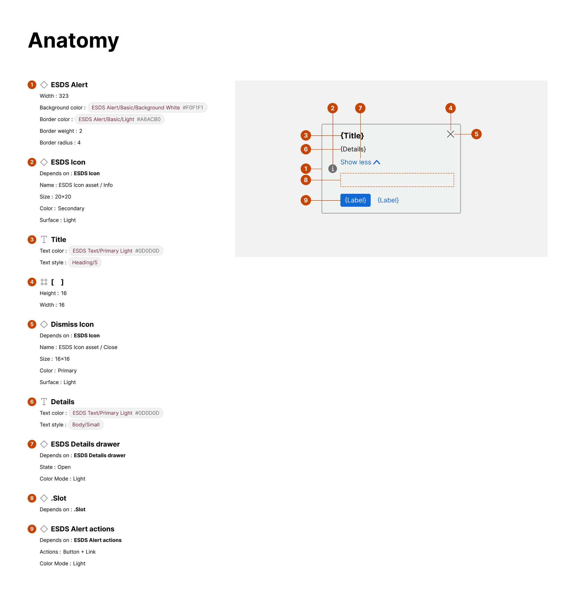
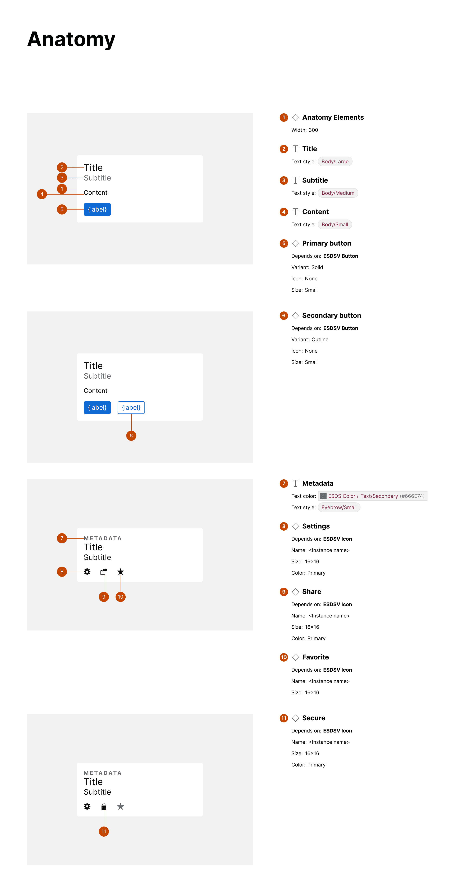
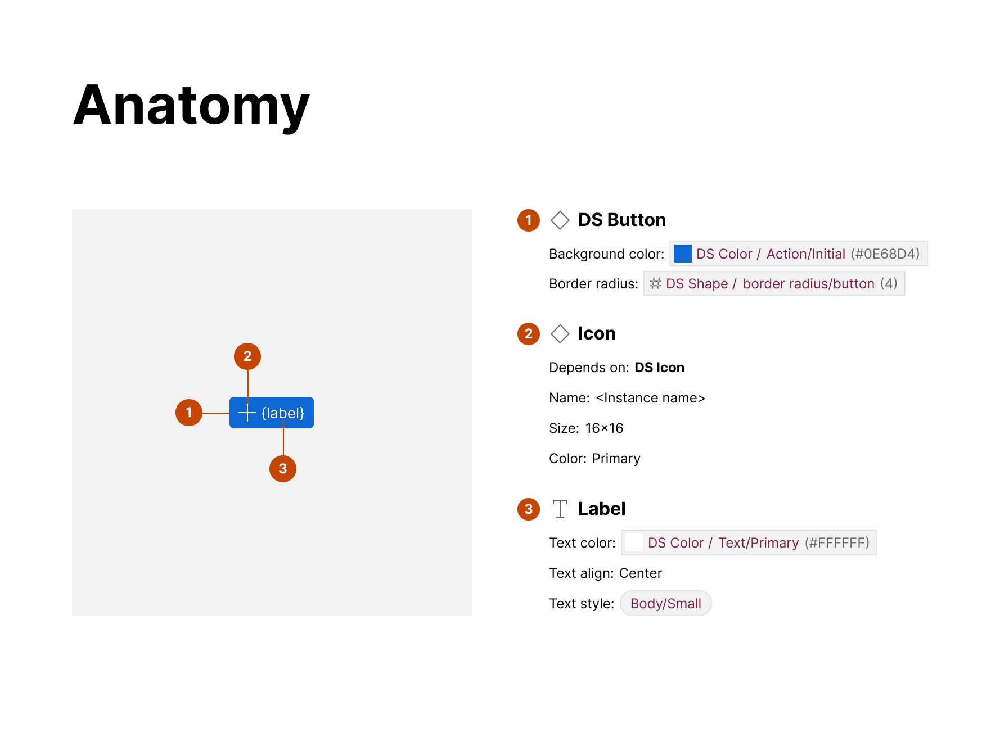
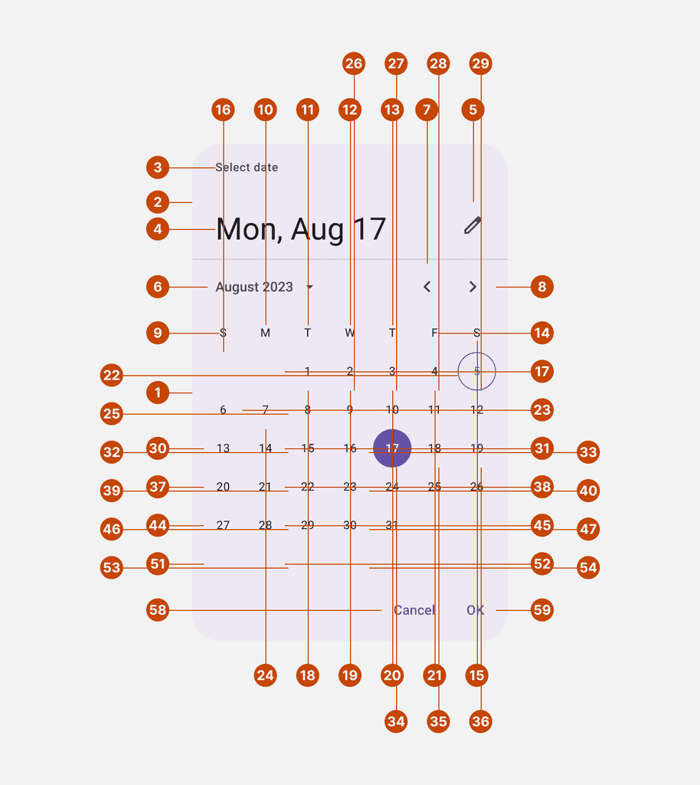

import { Aside } from '@astrojs/starlight/components';

You can annotate and display visual attributes of each element within an Anatomy section.

## What it includes

The Anatomy section comprises:

1. **An itemized element list** (the "content") that can include:
   - All text, line, polygon, star, rectangle, and similar layers encountered
   - All frame layers to which relevant attributes are associated
   - All nested component instances, but not any children layers within those nested instances

2. **A frame** (the "artwork") that includes a cloned version of the selected item and annotated markers associating each element with the enumerated item in the list

Relevant content can include:

- Element name
- Element Figma layer type (indicated by an icon)
- Dependency ("Depends on"), associating a nested instance with its origin component
- Visual attributes, such as background color, width and opacity, that — if Properties is also produced — are limited to those that do not vary across property options
- Configured property values of nested instances

## How it works

To produce the anatomy, the plugin traverses the node's layers to itemize and mark text, instances, and other shapes as elements.

Each itemized component is enumerated in the content, with instances highlighting dependency name and relevant prop values and other nodes reflecting visual attributes and styles. In the artwork, markers are placed on the periphery, prioritizing the left edge and finding a location on any edge that hasn't already been used.

<Aside>
The plugin stops traversing into the hierarchy of a component (like Card) when it runs into a nested component (like CardText). Spec authors are encouraged to run the plugin again on each relevant nested component.
</Aside>

The results work for most practical component displays, even if it's not perfect. In extreme cases, components with many sibling elements may "cross the streams" of each marker's tail and leave many components unmarked. In these cases, spec authors can prune and tailor what markers work best.

## Examples

### Simple anatomy

The Button anatomy includes elements for Icon, Label and the DS Button container (since it has relevant visual attributes applied to it).

### Complete anatomy

This card-like example has multiple anatomy sections, one for each variant that includes one or more newly detected elements. This complete anatomy feature is available for upgraded subscribers.

### Extreme example: Material modal date picker

In this extreme example, the Anatomy itemizes every cell of the calendar. As markers surround the date picker in a first ring, the plugin then begins including a second ring of markers slightly offset until those, too, run out of space. For each element, the plugin attempts to place a marker on all four sides in the first ring, then all four sides of the second ring, and then gives up.

