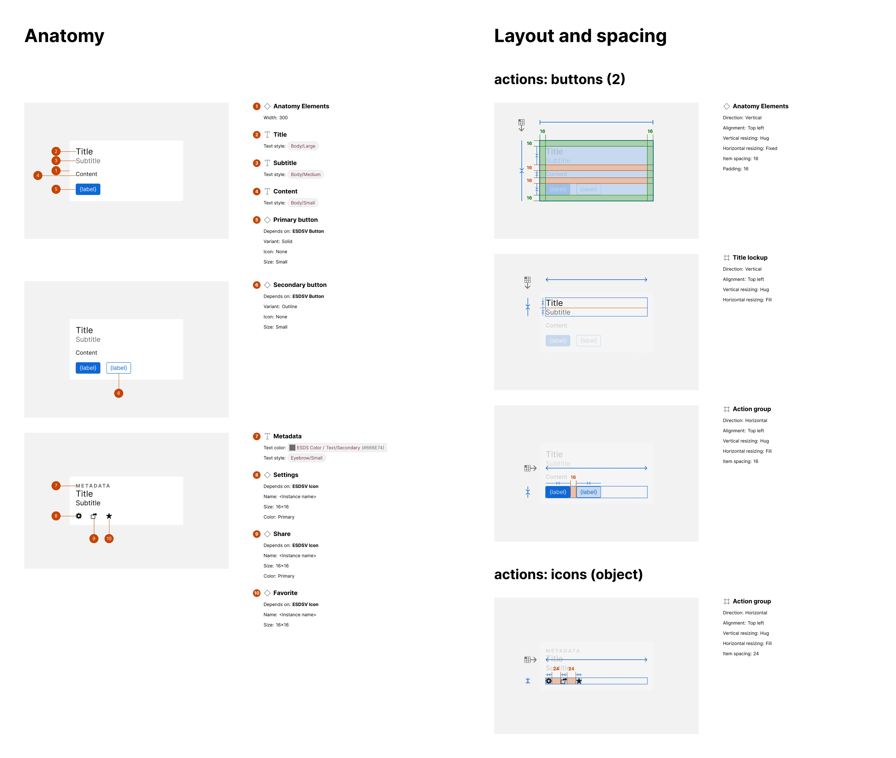

import { Aside, Badge } from '@astrojs/starlight/components';

<Badge text="Pro" variant="tip" />

The plugin detects additional elements and layouts across variants beyond those detected in the selected component and displays each in additional anatomy and layout rows.

## What is included

When properties are generated, elements and additional layout configurations may be detected in alternatives to the primary variant being annotated. Each will be identified in a successive exhibit, marked in artwork and itemized in relevant attributes not already displayed in the Properties section.

## How it works

As the Properties section is generated, each alternative variant is inspected for each property. As variants include distinct elements and layout not already detected, each is inventoried. When the Anatomy and Layout sections are subsequently generated, a row of artwork and annotation is generated for each variant that included one or more additional detected elements.

## Distinctness criteria

An element is considered distinct if the combination of all following criteria is unique:

1. Layer type (such as TEXT or INSTANCE)
2. Layer name (such as Settings or Title)
3. Layer parent hierarchy (such as Card / Title Lockup / Title)
4. Child position of layers at that level of the same type and name
