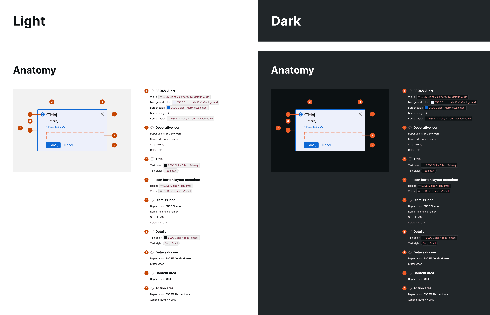
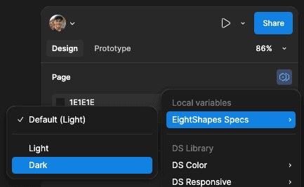
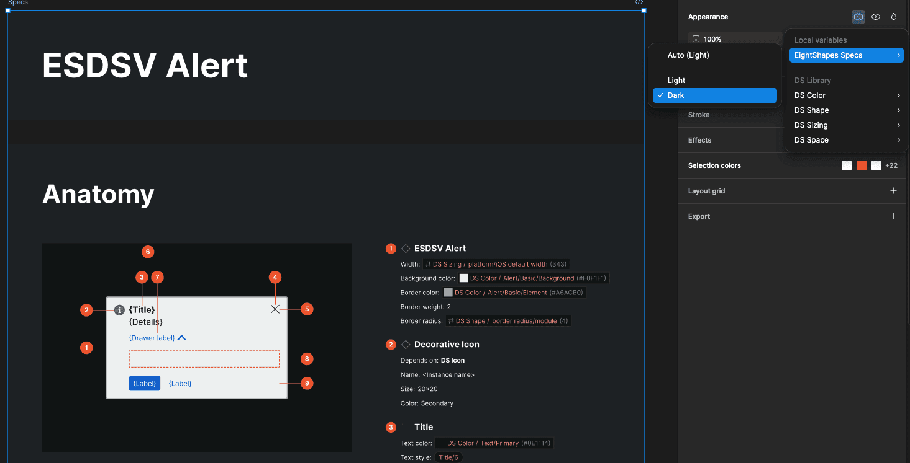
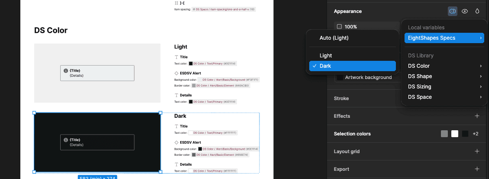

import { Badge } from '@astrojs/starlight/components';

<Badge text="Pro" variant="tip" />

EightShapes Specs plugin output can be toggled to the EightShapes Specs mode to dark.

## How it works

When Spec Styling settings generate or apply existing styling, color values are added as a dark mode option to the "EightShapes Specs" variable collection. Users can then toggle plugin output to dark mode at page, specification, or individual spec levels.

### Page-level

- Deselect all items on the page
- Click the Mode icon in the Page section of the Design panel
- Choose Light or Dark for EightShapes Specs mode

### All Specifications or a specific spec

- Select the Specifications frame or individual spec frame
- Click the Mode icon in the Layer section header
- Set EightShapes Specs mode preference

### Artwork frames

- Select the Artwork frame (use CMD/CTRL while hovering; use SHIFT+CMD/CTRL for multiple)
- Click the Mode icon in the Layer section header
- Toggle between Light or Dark modes

Plugin elements like markers and annotations adjust colors accordingly, while artwork itself remains unaffected.

## FAQs

### Why doesn't my EightShapes Specs variable collection include a dark column?

Dark mode requires accounts supporting multiple modes per collection. Starter Figma accounts limit collections to one mode — upgrade your account. Files in Drafts may also restrict this; move files to project folders. Run the plugin again with proper Spec Styling settings.

### When formatting specs as dark, some artwork becomes invisible. What's the solution?

Manually adjust the Artwork frame's mode or modify color variable values in the EightShapes Specs collection.
