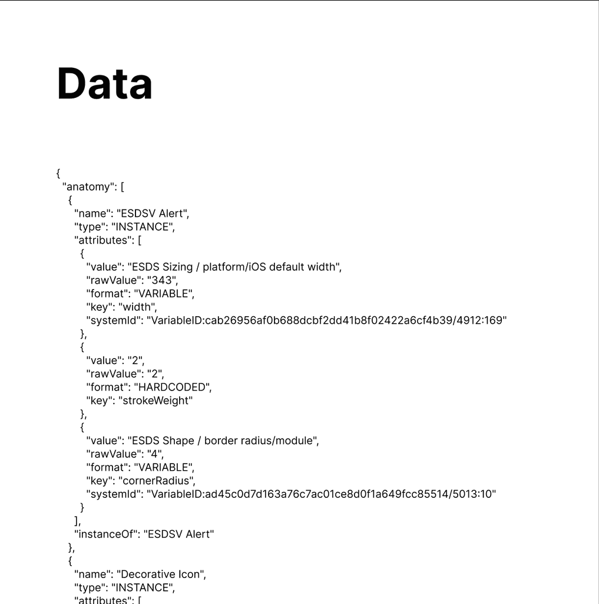

import { Aside } from '@astrojs/starlight/components';

The plugin can produce a Data section that includes specs in JSON format aligned with the structure, models and outcomes of what the plugin produces visually for the Anatomy and Properties sections.

<Aside type="note">
The Data feature is currently in beta for all subscribers, with anticipated limitation to paid subscribers upon completion.
</Aside>

## What it includes

The Data section includes specification text content transformed into a JSON structure to be copied and leveraged independently by plugin users.

## How it works

The plugin evaluates and compares elements, properties, options, and attributes during artwork traversal, adding those values to a JSON structure that gets cleaned and exported into a Figma text frame. Users may optionally exclude `attributes` from data output.

### JSON model structure

**Anatomy** — array of elements containing:
- `name`
- `type` (examples: FRAME, TEXT)
- `instanceOf` (instances only)
- `attributes` — array of property or visual attributes

**Attribute properties:**
- `value` (variables show collection/name concatenation; styles show name; hardcoded shows value)
- `format` (PROPERTY, HARDCODED, VARIABLE, or STYLE)

Visual attributes also include: `key`, `systemId` (Figma id for variables/styles), `rawValue`

Property attributes also include: `propertyName`

**Properties** — array containing:
- `name`
- `type` (VARIANT, BOOLEAN, TEXT, INSTANCE_SWAP)
- `default`
- `options` — array with `name` and `elements`

## FAQs

### Will Layout and Spacing attributes be included?

These features were out of scope for the initial beta but are under consideration. If these attributes are added, they are expected to be consolidated into the anatomy data.

### Will two-way comparison of properties be supported?

It is not expected that this feature will be supported by JSON data unless there's strong interest from subscribers.
