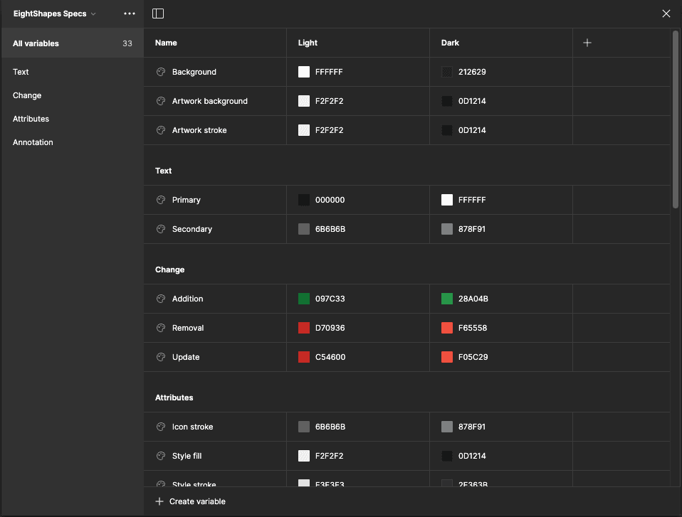
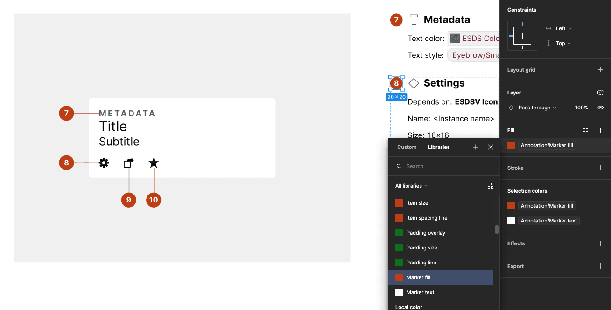
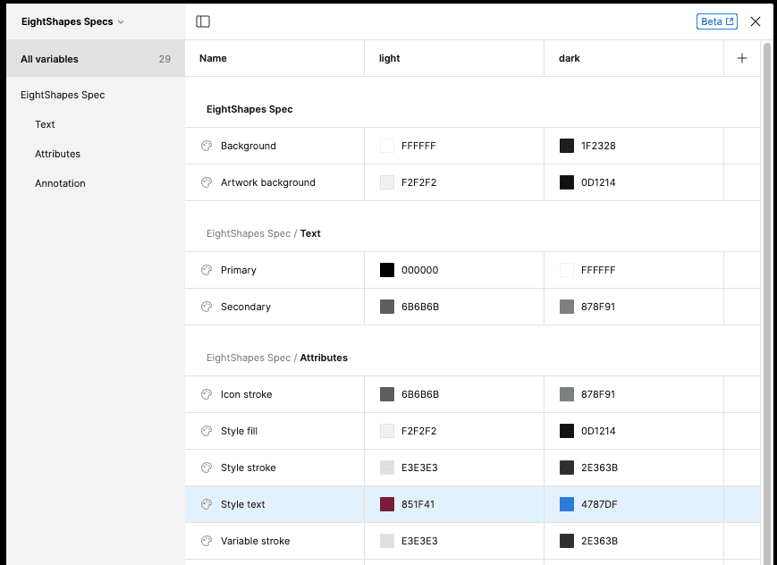

import { Badge } from '@astrojs/starlight/components';

<Badge text="Pro" variant="tip" />

You can generate, customize and apply custom variables to format specification colors.

## How it works

1. Subscribe to the Pro version.
2. In the `Settings` tab's Format section, select `Color`.

The plugin looks for relevant variables in a variable collection named `EightShapes Specs`. If a color variable does not exist, the plugin adds the variable to the local variable collection. As specifications are subsequently produced, each color is applied to relevant frames and text throughout the output.

## FAQs

### Can I associate spec output styling with other text styles and color styles or color variables in the local file or a library?

At this time, the plugin does not support mapping styling formats to other preexisting styles in your files or libraries. To request this feature, upvote Issue 39 on GitHub.

### Color variables and text styles added by the plugin show up as publishable when I publish my library. Can the plugin hide those by default?

The Figma plugin API does not yet support setting text styles, variables and variable collections to hide from publishing. When the API supports that functionality, the Specs plugin will hide styles and/or variables from publishing by default.
