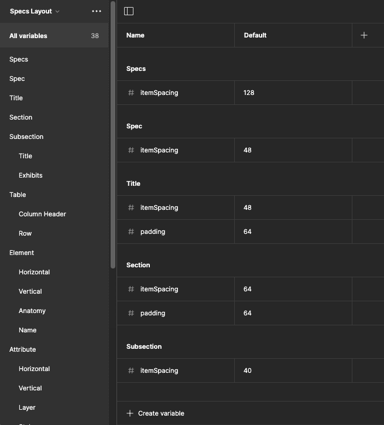
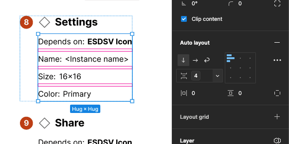

import { Badge } from '@astrojs/starlight/components';

<Badge text="Pro" variant="tip" />

You can generate, customize and apply custom variables to format specification spacing.

## How it works

1. Subscribe to the Pro version.
2. In the `Settings` tab's Format section, select `Layout and Spacing`.

The plugin looks for relevant variables in a variable collection named `Specs Layout`. If a layout and spacing variable does not exist, the plugin adds the variable to the local variable collection. As specifications are subsequently produced, each layout variable is applied to relevant frames throughout the output.

## FAQs

### Can I associate spec output styling with other text styles and color styles or color variables in the local file or a library?

At this time, the plugin does not support mapping styling formats to other preexisting styles in your local file or in a separate library. Users can upvote Issue 39 requesting this feature.

### Color variables and text styles added by the plugin show up as publishable when I publish my library. Can the plugin hide those by default?

The Figma plugin API does not yet support setting text styles, variables and variable collections to hide from publishing. This feature will be added when API support becomes available.
