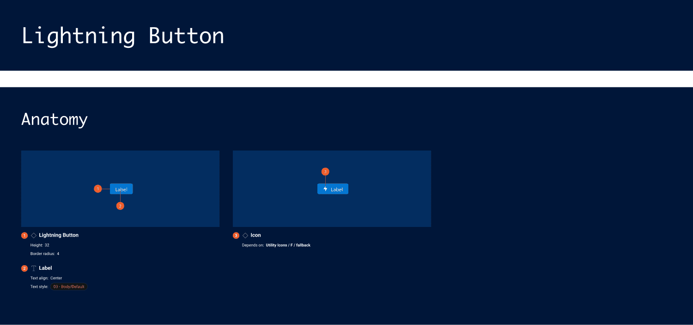
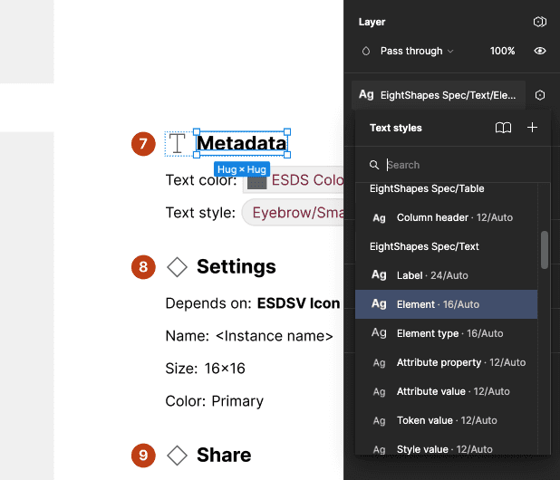
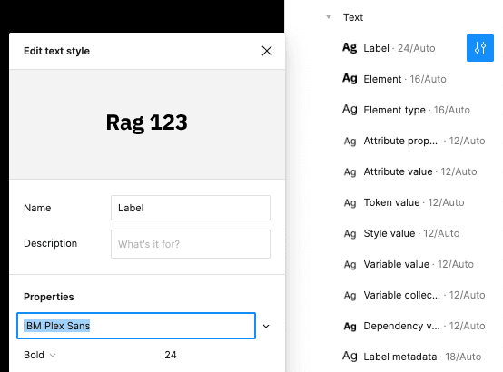
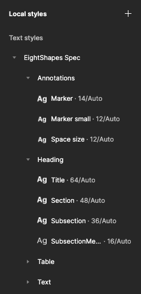

import { Badge } from '@astrojs/starlight/components';

<Badge text="Pro" variant="tip" />

You can generate, customize and apply custom text styles to format specification typography.

## How it works

1. Subscribe to the Pro version.
2. In the `Settings` tab's Format section, select `Typography`.

The plugin looks for local text styles in the file that begin with `EightShapes Spec`. If a text style does not exist, the plugin adds the text style to the local file. As specifications are subsequently produced, each text style is applied to relevant frames throughout the output.

Example: If your design system's primary `Font name` is `IBM Plex Sans`, you can update the `Font name` of each text style to that font name. Subsequent runs configured with `Spec styling` set to `Use local styles` or `Add local styles` will continue to apply these updated text styles.

## FAQs

### Can I associate spec output styling with other text styles and color styles or color variables in the local file or a library?

At this time, the plugin does not support mapping styling formats to other preexisting styles. Upvote Issue 39 to support adding this feature.

### Color variables and text styles added by the plugin show up as publishable when I publish my library. Can the plugin hide those by default?

The Figma plugin API does not yet support setting text styles to `hide from publishing`. However, text styles prepended with `.` are hidden from publishing by default. The Specs plugin detects existing EightShapes Specs styles beginning with `EightShapes Specs/...` or `.EightShapes Specs/...`, and applies either to specs output.
