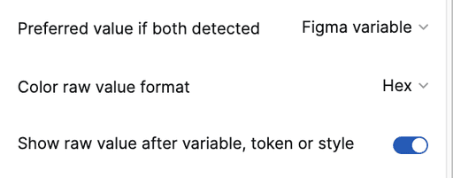

import { Badge } from '@astrojs/starlight/components';

<Badge text="Pro" variant="tip" />

Users can control how some values display in specification outputs.

## How it works

1. Subscribe to the Pro version.
2. In the Settings tab's Format section, select relevant settings to prioritize and format individual values.
3. When the plugin runs, it will format values accordingly.

### Preferred Value: Variable or Token?

When both a Figma variable and Tokens Studio token are detected for the same attribute and layer, users can specify which value displays:

- **Variable** (default)
- **Tokens Studio token**

Both values cannot be shown simultaneously.

### Color Value Format

Raw color values can be displayed as:

- **Hex** (default), such as `#FFFFFF`
- **HSLA**, such as `hsla(20, 45%, 74%, 1)`

### Display Raw Value After Styling

When a Figma variable, Tokens Studio token, Figma color style or Figma text style is detected, raw values are not shown by default. However, users can set raw values to display in parentheses following the preferred style.
