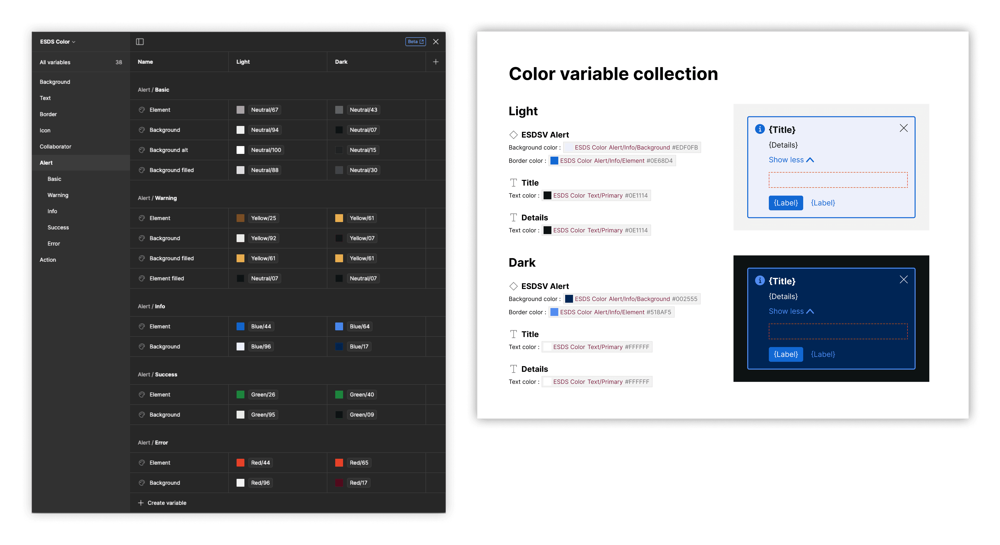
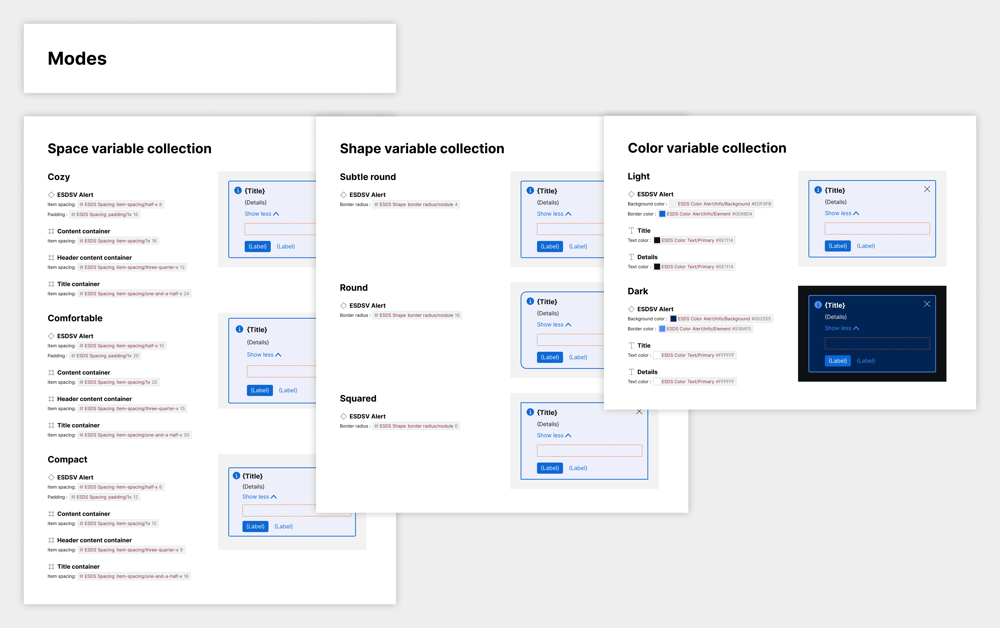

import { Aside, Badge } from '@astrojs/starlight/components';

<Badge text="Pro" variant="tip" />

The plugin can produce a Modes section that includes specs and artwork of items with layer-bound variables that (a) have multiple modes with (b) values that differ by mode.

## What is included

A Modes section appears when variables with differing values across two or more modes are detected. The plugin creates subsections for each matched variable collection, featuring artwork and attribute specifications for each mode.

## How it works

When users select to include a Modes section, the plugin will:

- Traverse all item layers to find variables bound to each layer
- Evaluate variables to determine relevance (varying across multiple modes)
- Create Modes specs subsections for each variable collection with relevant variables

Within each subsection, the plugin will:

- Display the item with that mode applied
- Compare relevant variables across modes
- Include attribute-by-attribute specifications showing variable value changes

## FAQs

### Will the Modes section include subsections when a variable from a variable collection with one mode are detected?

No. The plugin only creates subsections for variable collections containing two or more modes.

### Will the Modes section add spec'ed attributes for variables that don't vary across modes?

No. Such variables appear in the Anatomy section or Props section for property-based alternatives.

### Will the Modes section overlay spacing annotations like the Layout and Spacing section?

No, not currently. In the Modes section, artwork is presented for the overall item, such that layout and spacing annotations would be for all layers combined, muddling the display.
