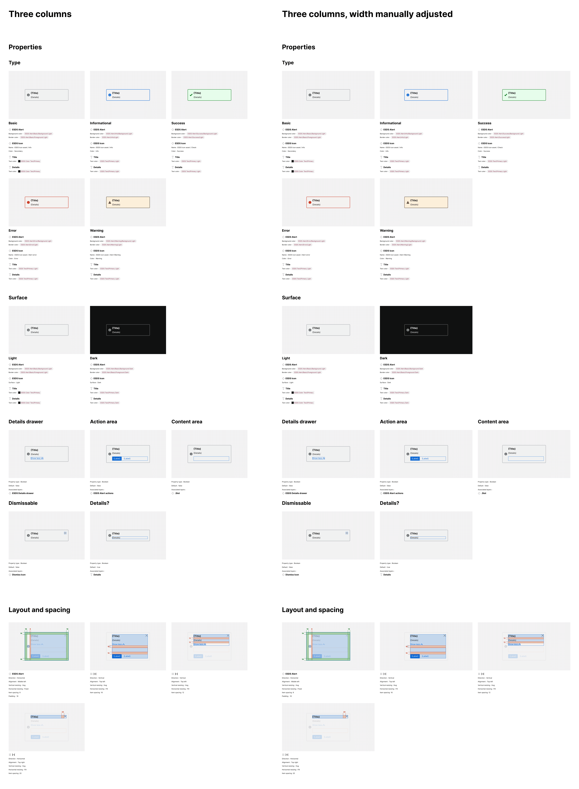
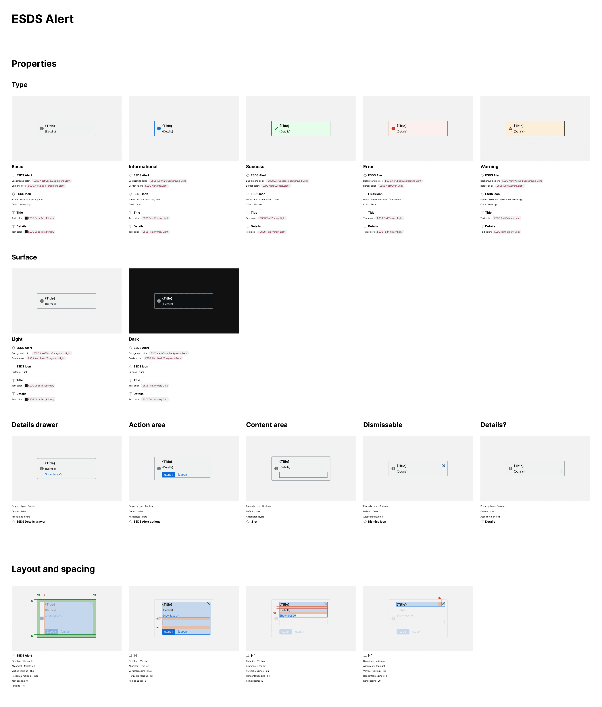
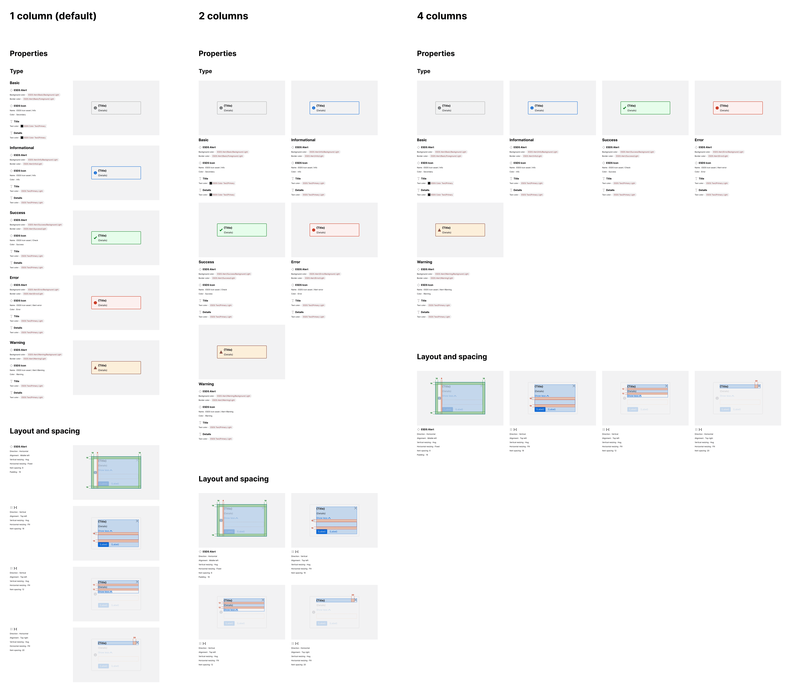

import { Badge } from '@astrojs/starlight/components';

<Badge text="Pro" variant="tip" />

The plugin enables users to arrange specs artwork and content in the Properties, Modes and Layout sections in a vertical stacked or multi-column format.

## What is included

By default, the plugin vertically arranges side-by-side displays of specification content (on the left) and artwork (on the right). Alternatively, you can set the plugin to automate the arrangement of artwork/content combinations into 2, 3, or 4 columns and also resize overall spec width to reflow those columns after specs are generated.

## How it works

When specs are set to layout in two or more columns, the plugin will:

- Generate specification displays as it would for a one column default display
- Identify the max width of artwork and content frames
- Set the minimum width of all artwork frames to match the maximum existing width
- Set the width of all content frames to the maximum content frame width
- Set the width of each section and subsection to enable display of the selected quantity of columns
- Add blank "spacer" exhibits (a common technique in CSS's flexbox) to sustain equal column widths as displays wrap across two or more rows

For sections and subsections that include fewer or more items than the column quantity, commensurate whitespace will remain to the right of the last item in the last row.

Once the specs are generated, a user can adjust the width of the `Specification` frame and spec artwork and content will adjust and resize within the layout (such as to show five columns) within reasonable limits.

### Three columns, manually resized

### Manually resized, beyond four columns

