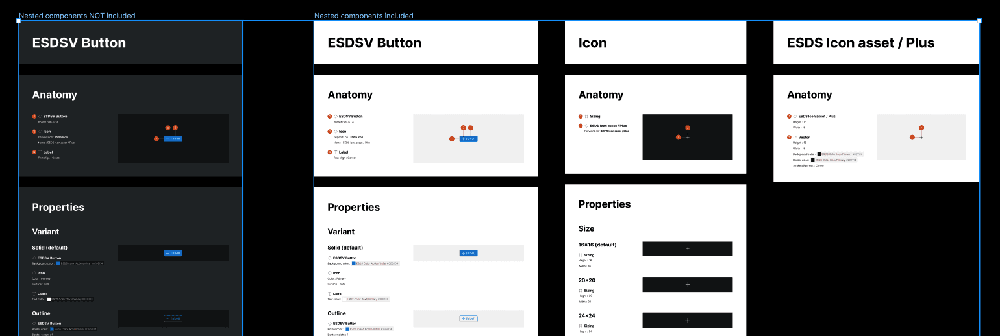

import { Badge } from '@astrojs/starlight/components';

<Badge text="Pro" variant="tip" />

The "Spec nested subcomponents" setting will add any instance encountered within selected items to also be spec'ed during that plugin run.

## How it works

1. Navigate to the plugin Settings tab
2. Set the **Spec nested subcomponents** toggle to active

## FAQs

### Will all nested components of a detected nested instance be spec'ed?

Only nested instances of the original selected item receive specifications. Additional variants within nested instances may not be included.
