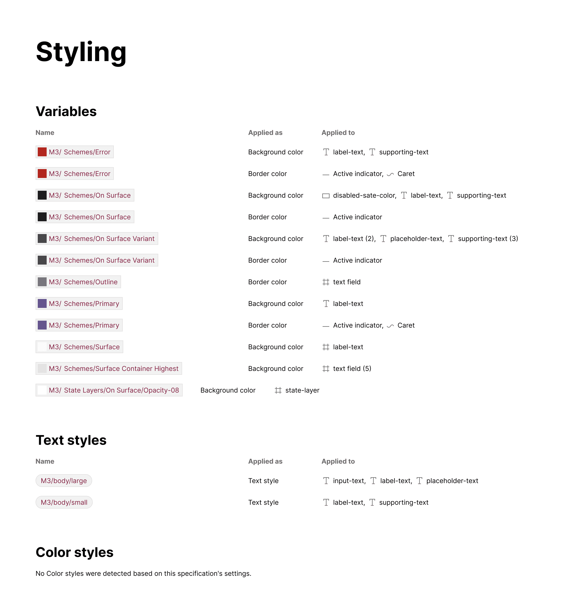

import { Aside } from '@astrojs/starlight/components';

The plugin generates inventories of styles, variables, and Token Studio tokens discovered during item and variant inspection.

<Aside type="note">
This feature is currently in beta for all subscribers, though variables and Token Studio token detection requires a subscription upgrade.
</Aside>

## What it includes

The Styling section contains detected variables, Token Studio tokens, text styles, and color styles organized in columns for:

- **Name**
- **Applied as** (the attribute receiving the style)
- **Applied to** (layer names where the system was applied, comma-separated, with quantity in parentheses if detected multiple times)

## How it works

As the plugin detects and displays variables, Tokens Studio tokens and styles throughout the specs, the values are logged and then displayed in inventory format afterwards in a separate section.
