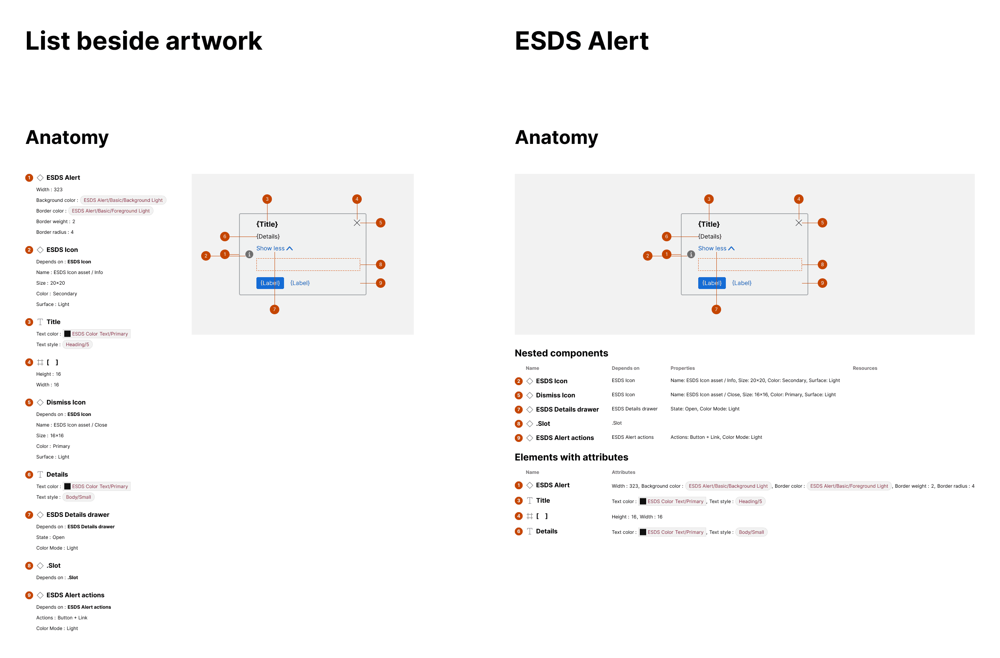

import { Badge } from '@astrojs/starlight/components';

<Badge text="Pro" variant="tip" />

The plugin offers two formats for the Anatomy section: List beside artwork and Table below artwork.

## What is included

When an anatomy is generated, elements and their associated attributes are arranged in a vertical format by default. Alternatively, anatomy content may be displayed in tabular format, resulting in up to two tables for nested components and other detected elements.

## How it works

For the alternative tabular format displayed below the annotated artwork, the plugin will:

- Construct a **"Nested components" table** for each nested component detected, with columns for component name (based on the nested layer name), dependency name, configured properties, and — when detected — associated links to dev resources
- Construct an **"Elements with attributes" table**, with columns for element name (based on layer name) and associated relevant attributes
- For instances, include the top layer in the "Other elements" table when that layer has relevant attributes
