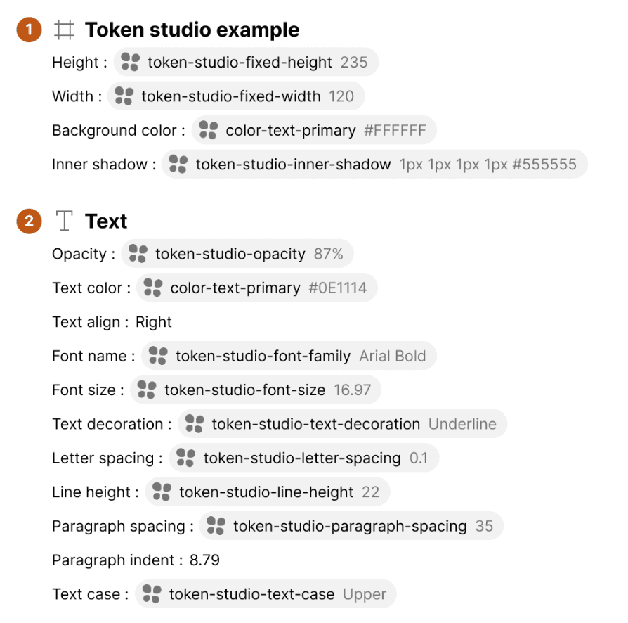
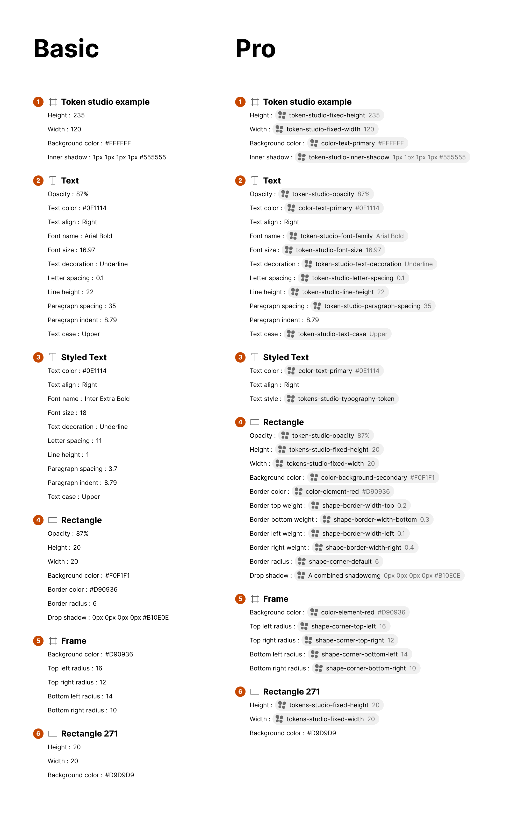
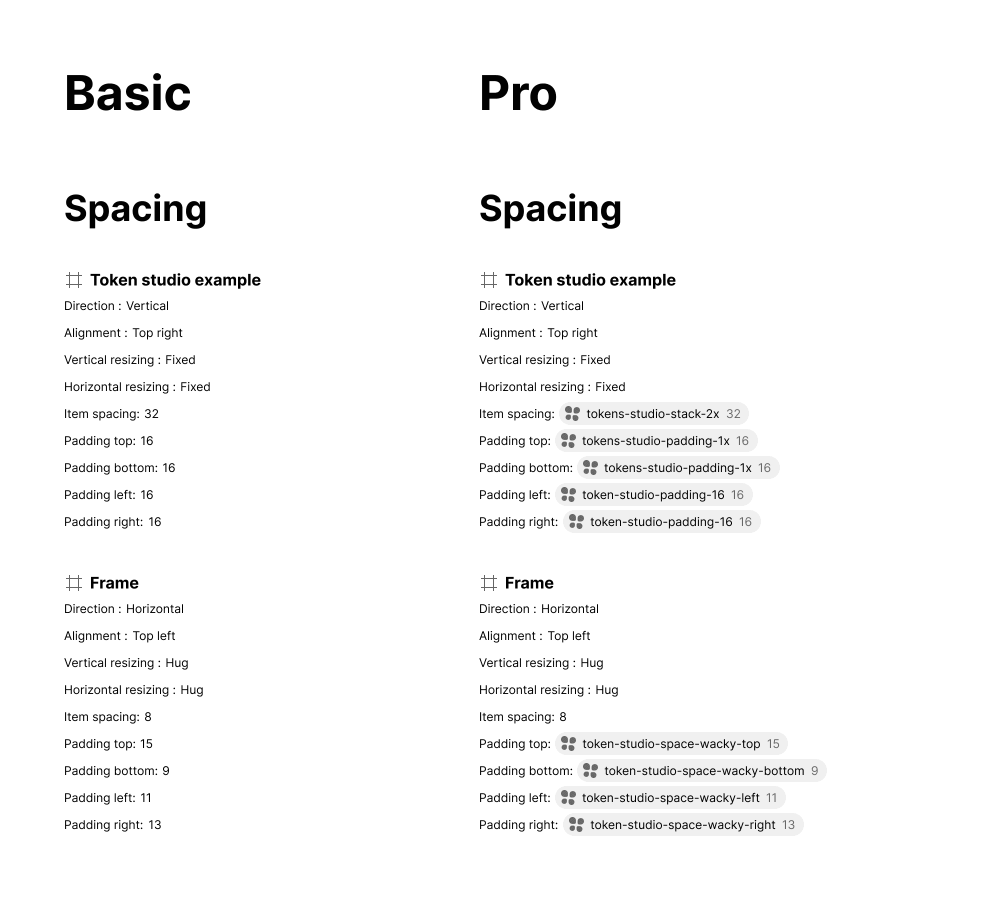

import { Badge } from '@astrojs/starlight/components';

<Badge text="Pro" variant="tip" />

The EightShapes Specs plugin Pro upgrade formats attributes as tokens managed by the Tokens Studio for Figma plugin available in the Figma Community.

## What it includes

Hardcoded values are replaced with detected Tokens Studio tokens in all three sections: Anatomy, Properties, and Layout and Spacing.

Tokens Studio tokens, when detected, are favored over both hardcoded attribute values as well as applied Figma styles for color, text and effects.

## How it works

1. Open the EightShapes Specs plugin.
2. Click on the Upgrade button.
3. Checkout to subscribe to EightShapes Specs plugin Pro.
4. Select one or more items to which Tokens Studio tokens have been applied.
5. Click on the Create Specs button.
6. View results.

## Supported attributes

Background blur, Border color, Border radius (all corners individually and combined), Border width (all sides individually and combined), Box shadow, Dimension, Fill, Font family, Font size, Height, Horizontal resizing, Item spacing (Gap in Token Studio), Line height, Layer blur, Layout alignment, Layout direction, Letter spacing, Opacity, Padding (top/bottom/left/right), Paragraph indent, Paragraph spacing, Sizing, Spacing, Text align horizontal, Text case, Text decoration, Typography, Vertical resizing, Width.

## Attributes not supported

Alpha (the `a` of `rgba` values), Asset, Border (composite), Composition, Description, Dimension (specific exceptions), Font weight, Sizing (specific exceptions), Visibility.

**Note on Composition:** Composition can be applied to a layer simultaneously with other Tokens Studio values (like Fill color), and Tokens Studio API returns both tokens as validly applied. The plugin would require decomposition into distinct attributes, creating performance and stability risks. Simply showing Composition when present is under consideration, but would run counter to expectations of how attributes are shown based on layer differences across variants.

