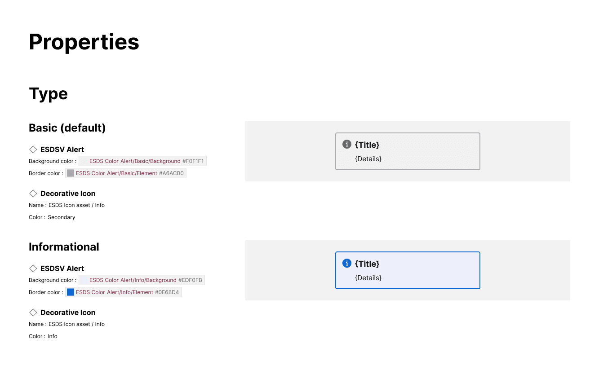
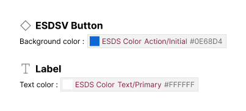

import { Badge } from '@astrojs/starlight/components';

<Badge text="Pro" variant="tip" />

The plugin will detect, format and compare attribute values mapped to Figma variables.

## What is included

For any variable on a supported attribute, the variable displays in pill format including the variable collection name, variable name, and raw value. For colors, the pill includes a square swatch matching the variable hex value.

## How it works

When a supported attribute (like Fill color, Width, or Item spacing) of an element is set to a Figma variable, the plugin will:

- Display that element in the content for that alternative
- Display that attribute value formatted as a Figma variable

For the Properties section, when a variable is detected on an attribute, the plugin will distinguish that alternative from others that apply a different variable OR a Tokens Studio token OR a hardcoded value, even if that hardcoded value matches the variable's value.

## FAQs

### If both a Figma variable and Tokens Studio token are encountered, what happens?

The plugin prioritizes formats in this order:

1. Figma variable
2. Figma style (for color, text and effect)
3. Tokens Studio token
4. Hardcoded value

The plugin will only display an attribute value based on the first format it encounters. When more than one format could be matched, only the first format is considered.
