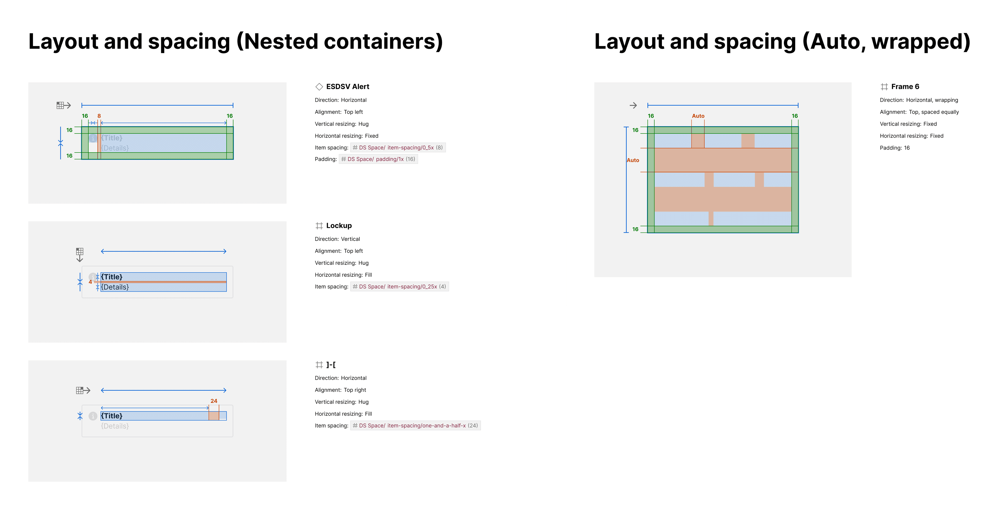

You can annotate padding, item spacing and other layout attributes and detail values for each layer with Autolayout in a Layout and spacing section.

## What it includes

The Layout and Spacing section includes:

- **Content** that specifies relevant layout attributes
- **Visual annotations** in artwork overlaid and adjacent to the relevant element layer

Relevant content can include:

- Element name
- Element Figma layer type (indicated by an icon)
- Layout direction, alignment, vertical/horizontal resizing
- Padding (overall and directional: left, top, right, bottom)
- Item spacing ("gap")

Visual annotations include:

- Element overlay (blue)
- Padding overlay (green)
- Item spacing overlay (orange)
- Padding and item spacing markers
- Layout direction and alignment icons
- Resizing markers (Fill, Fixed, Hug)

## How it works

The plugin traverses the item to find any layer configured with Figma autolayout to create an exhibit for that layer.

## FAQs

### Can I choose to simplify annotations?

Not all users value markers. A request for a setting to hide these markings is in the backlog.

### Can I hide less important visual annotations?

Yes — there's a setting to "Hide outer layout annotations" that omits markers for direction, alignment and resizing.
