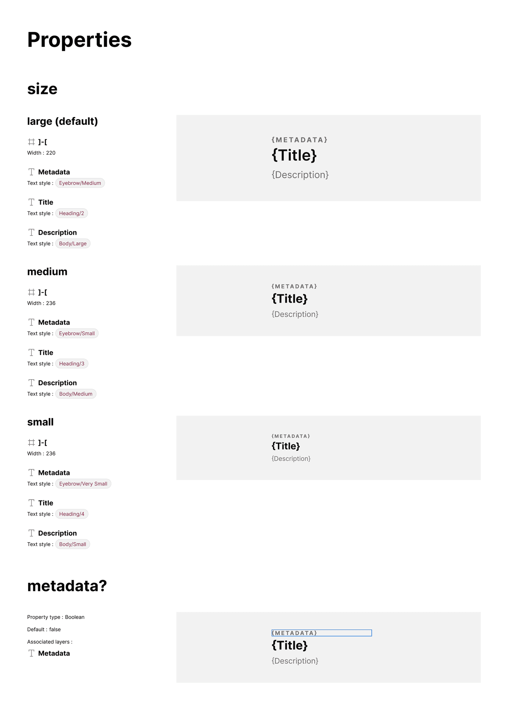

You can enumerate and display visual attribute differences across each element of variant options.

## What it includes

The Properties section includes:

- Subsections for each **Variant property** with all defined options
- Subsections for **Boolean properties** included in selected items
- Visual highlighting of impacted layers (blue highlight for Boolean props)

The plugin iterates through properties to highlight differences per option, comparing defaults with alternative options by traversing layers and examining attributes.

## How it works

The plugin compares a default with each alternative option by traversing layers and examining attributes.

## FAQs

### What if variants vary together, such that combinations of two variant properties result in different visual attributes?

This "compound props" case requires documenting how style changes across property combinations. The Pro version supports [two-way comparisons](/features/two-way/) to enumerate across each combination of two properties.

### Why does artwork sometimes show "Variant unavailable"?

This occurs when the plugin attempts to set properties creating a variant that doesn't exist in the component set.
